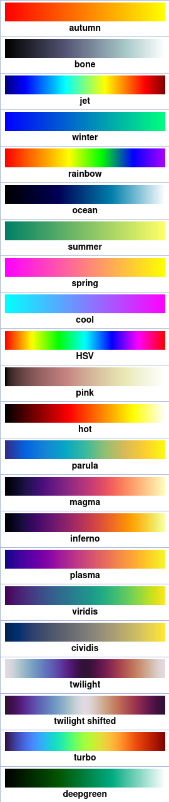
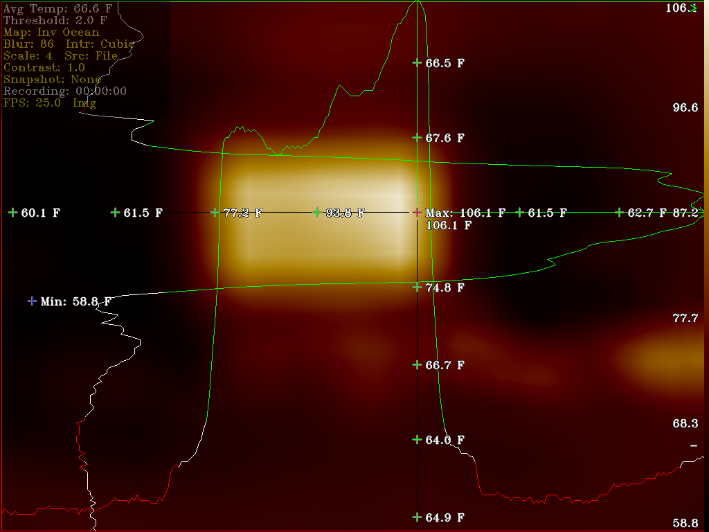
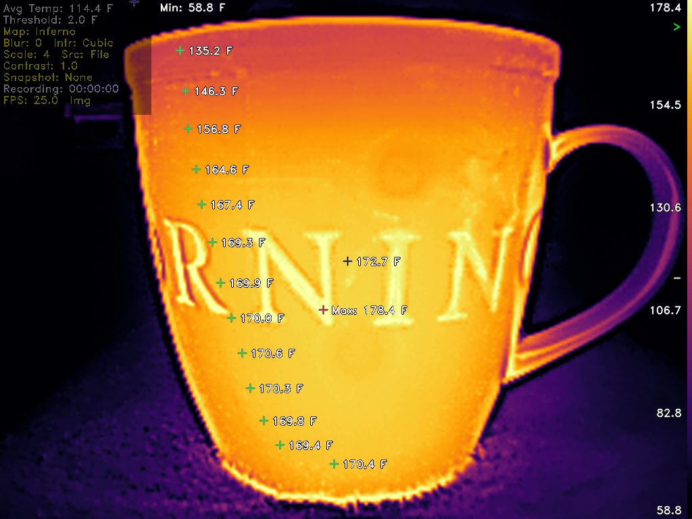
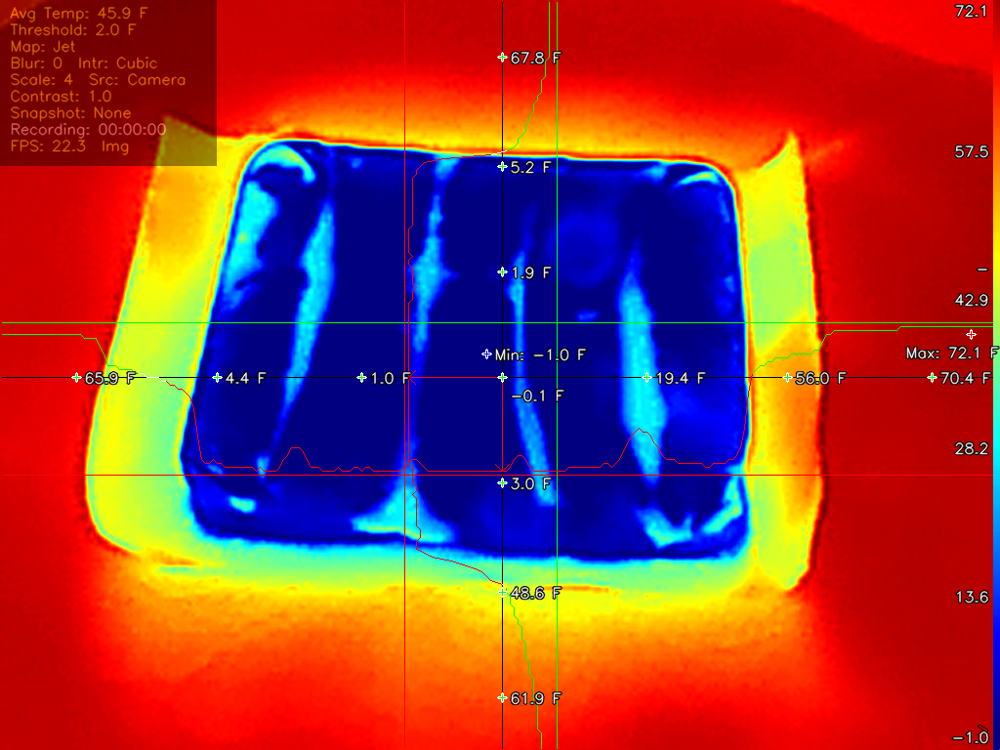

# Thermal-Camera-Redux
 Topdon TC001 (and clones) Linux thermal camera app to read and display live and offline thermal data. 

Ported and updated to Linux C/C++ app based on Les Wright's 21 June 2023 PyThermalCamera Python app. 
  - All prior licenses apply. 
  - https://github.com/leswright1977/PyThermalCamera - Python script  
  - https://github.com/92es/Thermal-Camera-Redux     - Ported C/C++ app  

  
  
A multi-threaded C/C++ app to read, parse, display thermal data from the Topdon TC001 Thermal camera (and clones). 
Rewritten with additional functionality, bug fixes, optimizations and offline post processing. 

## Features:

- Live mode reading from USB camera and Offline mode for post processing analysis.
  - Offline mode has great advantages over .png Snapshots because the raw thermal data can be represented with any configuration combinations at a later date as if it were live data.  No longer bound to a single colormap, scale, contrast, filter, etc. included in the static .png image.  Great for post documenting thermal audits depicting differnt data perspectives.
  - Freeze Frame mode offers an additional level of control in unstable hand held scenarios.
- Freeze frame, snapshots and recording.
- 4 layout modes displaying image and thermal data sub-frames.
  - Image sub-frame (Portrait or Landscape)
  - Thermal sub-frame (Portrait or Landscape)
  - Image sub-frame on left, Thermal sub-frame on right (Portrait or Landsacpe)
  - Image sub-frame on top, Thermal sub-frame on bottom (Portrait or Landscape)
- 4 display modes
  - With translucent OSD config menu
  - With translucent OSD key and mouse bindings menu
  - With out translucent OSD menu
  - With out translucent OSD menu and overlayed graphics, video image only
- Portrait and Landscape rotations in 90 degree increments.
- Translucent OSD settings and keybinding menus.
- Integer scaling from 1X native resolution to full screen.
- Switchable Celsius / Fahrenheit displays.
- Scalable video, fonts and graphic overlays.
- 3 user selectable fonts.
- 37 colormaps.
  - 22 OpenCV stock colormaps dipicted to the right.
  - 7 inverted OpenCV stock colormaps.
  - 7 generated colormaps.
  - Raw feed, no colormap.
- 7 interpolation methods.
  - Nearest
  - Linear
  - Cubic
  - Area
  - Lanczos
  - Linear Exact
  - Nearest Exact
- Video blur and contrast settings.
- Histogram Equalization filter.
- User settable Threshold delta from average temp in degrees C or F.
- Live gradient colormap scale widget.
- Color coded widgets depict:
  -  below (average - threshold) temps
  -  (average +/- threshold) temps
  -  above (average + threshold) temps
- Horizontal and vertical scrollable thermal plotting rulers.
  - Landscape ruler plots 256 plus 3, 5 or 7 text temps.
  - Portrait ruler plots 192 plus 3, 5 or 7 text temps.
- Thermal rulers have 5 modes with 4 clipping and 5 size settings.
  - 5 modes include:
    - Single relocatable temp.
    - Vertical and horizontal relocatable cross grid of text temps.
    - Individual horizontal or vertical relocatable plotting rulers.
    - Simulteanous horizontal and vertical relocatable plotting rulers.  
  - Cliping modes include:
    - no clipping (average baseline is proportional to Min/Avg/Max distribution)
    - outlier clipping (average baseline is centered in clippled plot)
    - below average clipping (focus on temps at or above average)
    - above average clipping (focus on temps at or below average)
  - Size settings include 1/5, 1/4, 1/3, 1/2 and full height ruler widths.
  - Horizontal and Vertical rulers can be displayed simultaenously or sepearately.
- Ability to add up to 13 user defined temp locations (great for fixed mount bench work).
- User temp and ruler display modes are mutually exclusive.
- Min, Avg and Max screen temps.
- Thermal color gradient widget with Min/Avg/Max and current focus temp indicators.
- User input can be entered via keyboard and/or mouse as well as commands redirected to stdin.
  -  Keyboard and mouse input take presendece over redirected stdin command stream.

## Build requirememts:
-  Linux, C/C++, OpenCV(V4L) and pthread libraries.
-  Optional build flags optimized for weak and single core / single threaded hardware.

Thermal Camera Redux:
	
Built with display 2560x1600, max:default scale 8:4, rotation 0, default Fahrenheit, 37 colormaps, Jet, 
    Multi-threaded with drag scrolling 

Tested on IvyBridge & Coffee Lake Debian 11 PCs with all features working 
Tested by Amish Technician (from EEVblog) on numerous RPi models including RPi Zero 2w, 2, 3, 4 and 5 
    using 2023-12-05 release of Raspberry Pi OS desktop 64-bit (Debian 12 bookworm) 

## Camera Usage:  
  ./redux -d n (where 'n' is the number of the desired video camera) 

## Offline Usage:  
  ./redux -f input.raw (where input.raw is a raw dump file from ./redux) 

## Optional flags:  
	[-rotate n] [-scale n] [-cmap n] [-fps n] [-font n] [-clip n] [-thick n]
	[-help] [-quiet] [-snapshot [prefix]]

## Mouse and Key Bindings: 

- a z: [In|De]crease Blur  
- s x: +/- threshold from avg temp that contols min/max displays and ruler plot colors 
- d c: Change interpolated window scale [camera native to fullscreen] 
- f v: [In|De]crease Contrast 
- g b: Cycle [for|back]wards through interpolation methods 
- j m: Cycle [for|back]wards through Color[m]aps 
- w  : Cycle through single/dual[horizontal/vertical] [w]indow layouts 
- 6  : Toggle between fullscreen and current scaled window size 
- r  : Toggle [r]ecording (.avi) 
- 1  : Select Font 
- 5  : Reset defaults 
- p  : Sna[p]shot (both .png and offline .raw) 
- h  : Cycle through overlayed screen data 
- t  : Toggle between Celsius and Fahrenheit  
- y  : Toggle Historgram Equalization filter  
- 8  : Rotate display 0, 90, 180, 270 degrees (Portrait and Landscape) 
- e  : Toggle Freeze Frame on/off 
- o  : Displays and cycles through 5 temp ruler modes 
- 3  : Ruler plot clip modes: none, outlier, below avg, above avg 
- 4  : Ruler thickness - 1/5, 1/4, 1/3, 1/2, full height 
  -   : Keypad Up/Down/Left/Right/Center(5) moves rulers 
  -   : Left mouse adds user temps or moves rulers 
  -   : Right mouse removes user temps and disables ruler mode 
- / : Misc stdout help information 
- q  : Quit 

## Example 1:  Full screen horizontal and vertical thermal ruler plots with, 4X scale and video blur settings applied.
  - Green sections of plot lines depict above (average + threshold) temps.
  - White sections of the plot lines depict (average +/- threshold) temps.
  - Red sections of the plot lines depict below (average - threshold) temps.
  - Ruler's focal point was relocated on the screen's Max temp location. 
    - The gradient scale's ">" marker in the upper right hand corner is Green indicating the focal point's respective temp range, above (average + threshold). 
    - The gradient scale's Avg temp marker "-" in the lower right hand corner is White, indicating the screen's current average temp. 
    - The Green lines extending from the focal points to both the Vertical and Horizontal plot lines indicate the relative temp at the current location.  Longer lines indicates a larger relative delta from the screen's Avg temp.  
    - All thermal ruler features update in real time from thermal data obtained by the camera and as the rulers are repositioned around the screen.

## Example 2: User Temp mode with 13 added users temps
  - If only the lady had this app when she ordered hot coffee from the McDonald's drive thru order window ...
  - This could be useful for fixed mount bench work.
  - Hi/Lo alarm triggers could be added to user temp points in the future for temp range monitoring and automated logging.

## Example 3: Dual scrolling ruler mode.
  - 1/5 screen height ruler size.
  - Proportional, non-clipping display mode.

## Potential Future Upgrades:
- Data logging over time.
- User temp alarm triggers.
- 3D solid and mesh surface plots.

## Credits:
- LeoDJ's Kelvin conversion algorithm from post #216 on EEVblog
- Les Wright's original Python script and corresponding YT video.
- Amish Technician's gracious RPi testing and valuable feedback.
- Cynfab for thermal range testing on the InfiRay P2 Pro.

  

