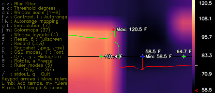
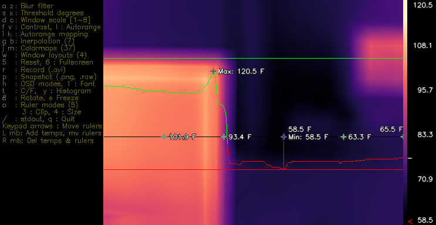
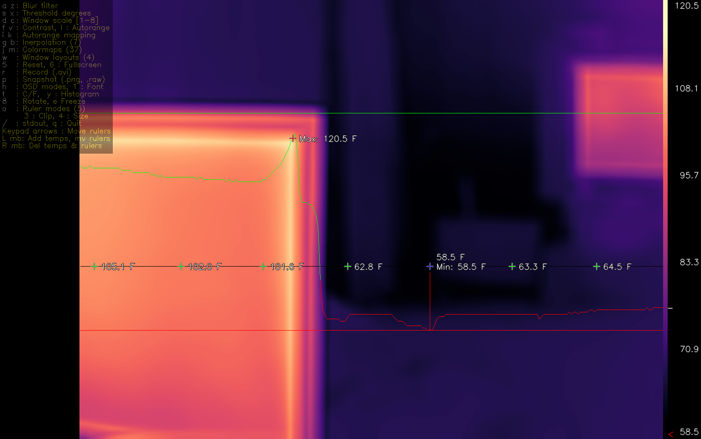

# Optional V 0.9.3 border layout build mode
  - To enable this feature, set -DBORDER_LAYOUT=1 in the build script and recompile.
  - Added dynamic left and right border display areas.
    - Border widths dynamically resize based on current scale factor, font selection and (-DDISPLAY_WIDTH=width or Fullscreen aspect ratio) constraints.
  - OSD informational display in left display border.
  - Colormap gradient widget in right display border.
  - Feature requested by Amish Technician.

The folowing depicts possible border width resizing from 1X scale to Fullscreen.

Note that the aspect ratio changes as scale changes ( to preserve square pixels ) until it reaches fullscreen.

At fullscreen, it adjusts border widths based on -DDISPLAY_WIDTH=width/-DDISPLAY_HEIGHT=height aspect ratio.

Depending on constrait permutations, the left and right border widths can shrink to 0.  

Both border widths reduced to 0 displays the original default compact layout with the widgets overlaying the video frame.

Selecting fullscreen will scale from the currently select scale factor, thus will appear differnt than other scale factors in fullscreen.  

Selecting the proper scale factor before entering fullscreen can taylor the fullscreen display. 

## 1X Scale ( DISPLAY_WIDTH border constraint )

## 2X Scale ( DISPLAY_WIDTH border constraint )

## Full Screen ( DISPLAY_WIDTH / DISPLAY_HEIGHT aspect ratio border constraint ):

Note: Translucent OSD in left border is getting moved over the video frame as the borders shrink.

